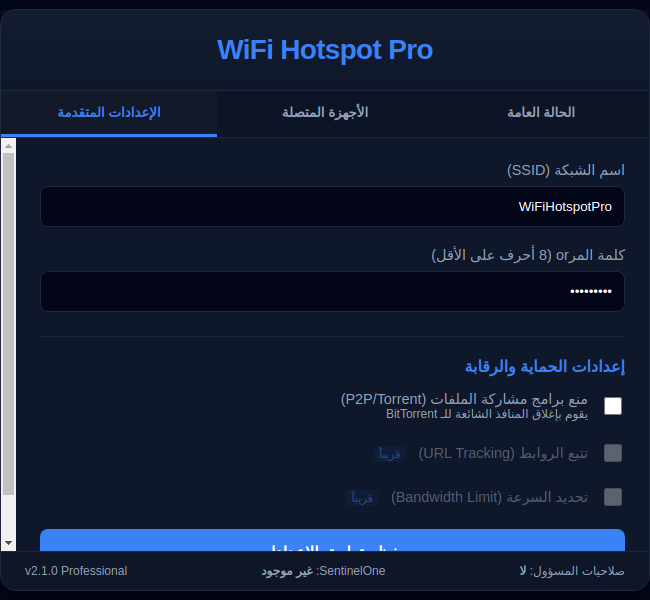
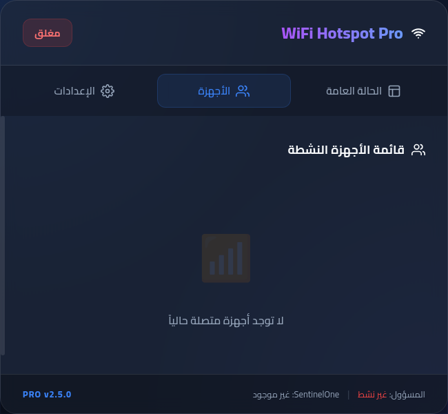

# 📡 WiFi Hotspot Pro

**تطبيق احترافي لمشاركة الإنترنت عبر نقطة اتصال WiFi**

نسخة مُحسّنة مع دعم بيئات الأمان المتقدمة، مصممة للعمل في بيئات تحتوي على **SentinelOne** وأنظمة حماية متقدمة أخرى.

---

## ✨ الميزات الرئيسية

- 🌐 **إنشاء نقطة اتصال WiFi آمنة** باستخدام معايير WPA2-Personal
- 👥 **إدارة الأجهزة المتصلة** مع عرض معلوماتها (IP و MAC Address)
- 🔒 **إعدادات أمان متقدمة** - حظر تطبيقات مشاركة الملفات (P2P)
- 🔐 **متوافق مع SentinelOne** - يستخدم واجهات برمجية شرعية فقط
- 💻 **واجهة مستخدم حديثة وسهلة الاستخدام** - تدعم اللغة العربية
- ⚡ **أداء محسّن** مع معالجة الأخطاء الشاملة

---

## 🖼️ لقطات التطبيق

### 📊 صفحة الحالة

*عرض حالة نقطة الاتصال والأجهزة المتصلة والمعلومات الحية*

### ⚙️ صفحة الإعدادات

*إعدادات الشبكة وتكوين نقطة الاتصال*

### 👥 صفحة الأجهزة

*قائمة الأجهزة المتصلة بالتفاصيل الكاملة*

---

## 📋 المتطلبات

- **نظام التشغيل**: Windows 10 أو أحدث
- **الصلاحيات**: مسؤول (Administrator)
- **Node.js**: v14 أو أحدث
- **npm**: v6 أو أحدث

---

## 🚀 التثبيت السريع (للمستخدم العادي)

### الطريقة الأسهل - تحميل المثبت الجاهز:

```bash
# 1. انقر على الرابط أسفل في قسم "Releases"
# 2. حمّل: WiFi Hotspot Pro 2.0.0.exe
# 3. انقر نقرتين على الملف
# 4. اتبع خطوات التثبيت
```

🔗 **[تحميل المثبت من هنا](https://github.com/hhhheeeeccc/wifi/releases)**

---

## 🛠️ بناء التطبيق (للمطورين)

### المتطلبات المسبقة:

```bash
# تحقق من Node.js
node --version    # يجب أن يكون v14+

# تحقق من npm
npm --version     # يجب أن يكون v6+
```

### الخطوة 1️⃣: استنساخ المستودع

```bash
git clone https://github.com/hhhheeeeccc/wifi.git
cd wifi
```

### الخطوة 2️⃣: تثبيت المكتبات

```bash
npm install
```

### الخطوة 3️⃣: بناء ملف التثبيت القابل للتثبيت

#### **Windows - الطريقة الأسهل (استخدم البرنامج النصي):**

```bash
# انقر نقرتين على الملف
build.bat
```

ثم اختر من القائمة:
```
1. ملف التثبيت (NSIS Installer)      ← الخيار الموصى به
2. الملف المحمول (Portable)
3. جميع الصيغ (All Formats)
4. اختبار التطبيق (npm start)
5. تنظيف وإعادة بناء
```

#### **Windows - الطريقة اليدوية:**

```bash
# بناء مثبت احترافي (NSIS)
npm run build:installer

# أو ملف محمول (بدون تثبيت)
npm run build:portable

# أو جميع الصيغ
npm run build
```

#### **Linux/Mac:**

```bash
chmod +x build.sh
./build.sh
```

ثم اختر الخيار المطلوب.

---

## 📦 النتيجة - الملفات المُنتجة

بعد البناء بنجاح، ستجد في مجلد `dist/`:

### ✅ **ملف التثبيت الاحترافي** (موصى به)
```
WiFi Hotspot Pro 2.0.0.exe
```
- حجم: ~120 MB
- يتضمن: مثبت احترافي مع واجهة رسومية
- مميزات:
  - اختيار مجلد التثبيت
  - إنشاء اختصارات سطح المكتب
  - إضافة إلى لوحة التحكم (Add/Remove Programs)
  - إمكانية الإلغاء البسيطة

**كيفية الاستخدام:**
```bash
1. انقر نقرتين على WiFi Hotspot Pro 2.0.0.exe
2. اختر اللغة
3. اقرأ الاتفاقية واضغط "موافق"
4. اختر مجلد التثبيت أو اترك الافتراضي
5. اضغط "تثبيت"
6. اضغط "إنهاء"
```

### ✅ **الملف المحمول** (بدون تثبيت)
```
WiFi Hotspot Pro-2.0.0-portable.exe
```
- حجم: ~100 MB
- لا يحتاج تثبيت
- مثالي للـ USB
- لا يترك آثار في السجل

**كيفية الاستخدام:**
```bash
# شغله مباشرة من أي مكان
WiFi Hotspot Pro-2.0.0-portable.exe
```

---

## 🔧 أوامر البناء المتقدمة

### أوامر npm مباشرة:

```bash
# تشغيل التطبيق في وضع التطوير
npm start

# بناء مثبت NSIS (التثبيت الاحترافي)
npm run build:installer

# بناء ملف محمول (بدون تثبيت)
npm run build:portable

# بناء جميع الصيغ
npm run build

# تنظيف المكتبات وإعادة البناء
rm -rf node_modules
npm install
npm run build
```

---

## 📍 الملفات المهمة

| الملف | الوصف |
|------|-------|
| `package.json` | إعدادات البناء و electron-builder |
| `build.bat` | برنامج بناء Windows |
| `build.sh` | برنامج بناء Linux/Mac |
| `src/main/index.js` | المنطق الرئيسي |
| `src/ui/index.html` | الواجهة الرئيسية |
| `src/preload/index.js` | جسر الأمان |

---

## 🏗️ بنية المشروع

```
wifi/
├── src/
│   ├── main/               # عمليات Electron الرئيسية
│   │   ├── index.js        # نقطة الدخول
│   │   ├── handlers/       # معالجات منفصلة
│   │   └── utils/          # أدوات مساعدة
│   ├── preload/            # جسر الأمان
│   └── ui/                 # الواجهة
│       ├── index.html
│       ├── css/            # أنماط منفصلة
│       └── js/             # تطبيق محسّن
├── assets/                 # الأيقونات والصور
├── dist/                   # مخرجات البناء
├── build.sh                # برنامج البناء (Linux/Mac)
├── build.bat               # برنامج البناء (Windows)
└── package.json            # معلومات المشروع
```

📖 **[اقرأ المزيد عن البنية](PROJECT_STRUCTURE.md)**

---

## 🔒 الأمان والخصوصية

### معايير الأمان المطبقة
✅ **استخدام Windows APIs الشرعية فقط** - لا توجد تعديلات على السجل بشكل مباشر  
✅ **عزل السياق (Context Isolation)** - منع إساءة استخدام Node API  
✅ **تطهير المدخلات** - منع حقن الأوامر (Command Injection)  
✅ **توافق SentinelOne** - لا يستدعي سلوك يشبه الاستغلالات  
✅ **تشفير WPA2** - كل الاتصالات محمية  

### دعم بيئات SentinelOne
التطبيق مصمم للعمل في بيئات بها **SentinelOne** مثبتة:
- يستخدم Windows APIs الموثوقة فقط
- تجنب السلوك الذي قد يُعتبر مريباً
- لا يعدّل السجل بطرق غير آمنة
- يتعامل مع الأخطاء بشكل آمن

---

## 📚 التوثيق الإضافية

لمزيد من المعلومات التقنية، راجع:
- [دليل البناء الشامل](BUILD_GUIDE.md) - شرح تفصيلي لكل طريقة بناء
- [تعليمات التثبيت](INSTALLATION.md) - للمستخدم والمطور
- [البداية السريعة](QUICK_START.md) - شرح سريع في 5 دقائق
- [معمارية المشروع](PROJECT_STRUCTURE.md) - شرح بنية الملفات
- [معلومات الوكلاء](AGENTS.md) - تفاصيل البيئة

---

## 🐛 تقارير الأخطاء والمساهمة

### إبلاغ عن مشاكل
إذا واجهت أي مشاكل، يرجى:
1. التحقق من أنك تملك صلاحيات المسؤول
2. التأكد من اتصالك بالإنترنت
3. فتح [issue](https://github.com/hhhheeeeccc/wifi/issues) جديدة مع وصف المشكلة

### المساهمة
نرحب بالمساهمات! يرجى:
1. Fork المستودع
2. إنشاء فرع للميزة الجديدة
3. Commit التغييرات
4. Push للفرع
5. فتح Pull Request

---

## 📄 الترخيص

هذا المشروع مفتوح المصدر. جميع الحقوق محفوظة ©

---

## 📞 الدعم والتواصل

- 🐛 **Issues**: استخدم نظام Issues للإبلاغ عن المشاكل
- 💬 **Discussions**: شارك أفكارك واقتراحاتك
- 📧 **البريد الإلكتروني**: تواصل عبر المستودع

---

## 🎯 خريطة الطريق المستقبلية

- ✏️ دعم تعديل كلمة المرور أثناء التشغيل
- 🌐 إضافة دعم VPN
- 📊 لوحة إحصائيات متقدمة
- 🔔 تنبيهات الاتصالات الجديدة
- 🌍 دعم لغات إضافية

---

## ⚡ أسئلة شائعة

### س: كيف أحصل على ملف التثبيت بسرعة؟
**ج:** حمّل `WiFi Hotspot Pro 2.0.0.exe` من قسم [Releases](https://github.com/hhhheeeeccc/wifi/releases)

### س: هل يحتاج التطبيق إلى Node.js بعد التثبيت؟
**ج:** لا، المثبت يحتوي على كل شيء. Node.js مطلوب فقط للبناء من المصدر.

### س: هل يعمل مع SentinelOne؟
**ج:** نعم، التطبيق مصمم خصيصاً للعمل مع SentinelOne وأنظمة الأمان المتقدمة.

### س: ما حجم الملف المثبت؟
**ج:** حوالي 120 MB (يشمل Electron وكل المكتبات المطلوبة)

### س: هل يمكن نقل الملف المحمول إلى USB؟
**ج:** نعم تماماً، الملف المحمول مثالي للـ USB والأجهزة المحمولة.

---

**WiFi Hotspot Pro v2.1.0** | تطبيق احترافي للشبكات | مفتوح المصدر  
**آخر تحديث:** يونيو 2026
